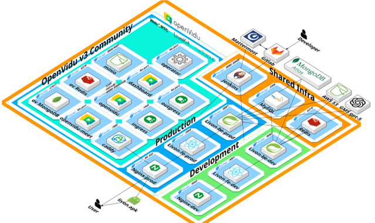

# LivOn

건강/웰니스 코칭 플랫폼 — 코치와 회원을 연결하고, 실시간 화상 상담과 AI 건강 분석을 제공합니다.

## 서비스 소개

LivOn은 건강 관리가 필요한 사용자와 전문 코치를 연결하는 통합 헬스케어 코칭 플랫폼입니다. 회원은 코치를 탐색하고 1:1 또는 그룹 상담을 예약할 수 있으며, LiveKit 기반의 실시간 화상 스트리밍과 WebSocket 채팅을 통해 어디서든 상담에 참여할 수 있습니다. 건강 설문 데이터를 바탕으로 GCP Vertex AI가 개인 맞춤형 건강 요약을 생성하여, 코치가 상담 전 회원의 건강 상태를 빠르게 파악할 수 있습니다.

## 강점

- **실시간 화상 상담**: LiveKit 기반 고품질 WebRTC 스트리밍으로 1:1 및 그룹 상담 지원
- **AI 건강 분석**: GCP Vertex AI(Gemini)를 활용한 개인 맞춤형 건강 데이터 요약 및 인사이트 제공
- **멀티 플랫폼**: 웹과 Android 네이티브 앱을 동시 지원하여 접근성 극대화
- **실시간 채팅**: STOMP/WebSocket 기반 채팅으로 상담 중 원활한 소통
- **상담 녹화 및 아카이브**: GCP Cloud Storage를 통한 상담 녹화 보관

## 개발 기간

| 항목 | 내용 |
|------|------|
| 기간 | 2025.10.07 ~ 2025.12.01 (약 8주) |

## 개발 인원 및 팀원

| 이름 | 역할 | 담당 |
|------|------|------|
| 정원준 | 팀장 | 주요 백엔드 비즈니스 로직 개발 |
| 전재욱 | 팀원 | WebSocket 채팅 구현 |
| 박민수 | 팀원 | Infra, Google Cloud Platform 구축 |
| 차민규 | 팀원 | 웹 프론트엔드 구현 |
| 김명주 | 팀원 | 모바일 LiveKit 화상 상담 구현 |
| 제효정 | 팀원 | 모바일 프론트엔드 구현 |

## 플랫폼

| 플랫폼 | 설명 |
|--------|------|
| Web | React 기반 SPA (데스크톱/모바일 브라우저) |
| Android | Kotlin + Jetpack Compose 네이티브 앱 |

## 기술 스택

### Backend

| 분류 | 기술 |
|------|------|
| Language | Java 17 |
| Framework | Spring Boot 3.3.1 |
| ORM | Spring Data JPA (Hibernate) |
| Database | MySQL, MongoDB (채팅 메시지), Redis (캐싱/세션) |
| Security | Spring Security, JWT (jjwt 0.11.5) |
| WebSocket | Spring WebSocket, STOMP |
| AI | GCP Vertex AI (Gemini 2.5 Flash Lite) |
| Storage | AWS S3, GCP Cloud Storage |
| Video | LiveKit Server SDK 0.8.2 |
| Docs | SpringDoc OpenAPI (Swagger) 2.0.3 |
| Build | Gradle |

### Frontend (Web)

| 분류 | 기술 |
|------|------|
| Language | TypeScript 4.9.5 |
| Framework | React 19.2.0 |
| Routing | React Router 7.9.4 |
| Styling | styled-components 6.1.19 |
| HTTP | Axios 1.13.2 |
| WebSocket | @stomp/stompjs, sockjs-client |
| Video | livekit-client 2.15.14 |
| Build | Create React App (react-scripts 5.0.1) |

### Frontend (Mobile)

| 분류 | 기술 |
|------|------|
| Language | Kotlin |
| UI | Jetpack Compose |
| Networking | Retrofit 2.9.0, OkHttp 4.12.0, Ktor |
| WebSocket | StompProtocolAndroid, RxJava 2 |
| Video | LiveKit Android SDK |
| Serialization | Kotlinx Serialization, Moshi |
| Min SDK | 23 (Target: 35) |

### Infra / DevOps

| 분류 | 기술 |
|------|------|
| CI/CD | Jenkins |
| Container | Docker, Docker Compose |
| Reverse Proxy | Nginx 1.27 |
| SSL | Let's Encrypt |
| Notification | Mattermost Webhook |

## 시스템 아키텍처



## 빌드 및 배포

### 로컬 개발 환경

**Backend**

```bash
cd LivOnBack
# application.yml 설정 후
./gradlew bootRun
```

**Frontend (Web)**

```bash
cd LivOnFront/web
npm install
npm start
# http://localhost:3000
```

**Frontend (Mobile)**

```bash
cd LivOnFront/mobile
# local.properties에 Android SDK 경로 설정
./gradlew assembleDebug
```

### Docker 배포

**개발 환경**

```bash
cd LivOnInfra
docker compose -f docker-compose.dev.yml up --build -d
```

**운영 환경**

```bash
cd LivOnInfra
docker compose -f docker-compose.prod.yml up --build -d
```

### CI/CD (Jenkins)

Jenkins 파이프라인이 브랜치에 따라 자동 배포합니다:

- `master` 브랜치 → 운영 환경 배포
- 기타 브랜치 → 개발 환경 배포

변경 감지 기반으로 Backend, Frontend, Mobile을 선택적으로 빌드/배포하며, 결과를 Mattermost로 알림합니다. Mobile APK는 빌드 후 `/download` 경로에서 다운로드 가능합니다.

## 디렉토리 구조

```
S13P31S406/
├── Jenkinsfile                     # CI/CD 파이프라인
├── LivOnBack/                      # Backend (Spring Boot)
│   ├── Dockerfile
│   ├── build.gradle
│   └── src/main/java/com/s406/livon/
│       ├── domain/
│       │   ├── ai/gms/            # AI 건강 분석
│       │   ├── auth/              # 인증/인가
│       │   ├── coach/             # 코치 관리 및 상담
│       │   ├── consultation/      # 상담 예약 조회
│       │   ├── goodsChat/         # 실시간 채팅
│       │   ├── openvidu/          # 화상 스트리밍 (LiveKit)
│       │   └── user/              # 회원 관리 및 건강 설문
│       └── global/
│           ├── config/            # Security, WebSocket, Redis, S3 등
│           ├── error/             # 예외 처리
│           ├── s3/                # S3 유틸리티
│           └── security/jwt/      # JWT 토큰 처리
├── LivOnFront/
│   ├── web/                        # Frontend Web (React)
│   │   ├── Dockerfile
│   │   ├── package.json
│   │   └── src/
│   │       ├── api/               # API 연동 레이어
│   │       ├── components/        # 공통/레이아웃/스트리밍 컴포넌트
│   │       ├── hooks/             # 커스텀 훅 (useAuth, useStreaming 등)
│   │       ├── pages/             # 페이지 (auth, coach, main, support)
│   │       ├── routes/            # 라우팅 및 권한 보호
│   │       ├── types/             # TypeScript 인터페이스
│   │       └── utils/             # 유틸리티 함수
│   └── mobile/                     # Frontend Mobile (Android)
│       └── app/src/main/java/com/livon/app/
│           ├── core/              # DI, 네트워크, 유틸리티
│           ├── data/              # 데이터 레이어 (API, Repository)
│           ├── domain/            # 도메인 모델
│           ├── feature/           # 기능별 화면 (coach, member, shared)
│           ├── navigation/        # 내비게이션 그래프
│           └── ui/                # 테마 및 공유 UI
└── LivOnInfra/                     # 인프라 설정
    ├── docker-compose.dev.yml
    ├── docker-compose.prod.yml
    └── nginx/
        ├── nginx.dev.conf
        └── nginx.prod.conf
```

## 주요 기능

### 회원 (Member)

| 기능 | 설명 |
|------|------|
| 회원가입 / 로그인 | 이메일 기반 인증, JWT 토큰 관리 |
| 코치 탐색 | 코치 목록 조회, 직종/소속별 필터링, 상세 정보 확인 |
| 상담 예약 | 1:1 상담, 그룹 상담 예약 및 취소 |
| 화상 상담 참여 | LiveKit 기반 실시간 영상/음성 스트리밍 |
| 실시간 채팅 | 상담 중 STOMP/WebSocket 기반 텍스트 채팅 |
| 건강 설문 | 체중, 신장, 걸음 수, 수면, 복약, 스트레스 등 건강 데이터 입력 |
| AI 건강 분석 | 설문 데이터 기반 AI 맞춤형 건강 요약 확인 |

### 코치 (Coach)

| 기능 | 설명 |
|------|------|
| 상담 관리 | 1:1/그룹 상담 생성, 수정, 삭제 |
| 스케줄 관리 | 상담 가능 시간 설정, 차단 시간 관리 |
| 화상 상담 진행 | 실시간 스트리밍 세션 생성 및 진행 |
| 상담 녹화 | 상담 세션 녹화 및 GCP Cloud Storage 보관 |
| 회원 건강 확인 | 상담 전 회원의 AI 건강 요약 확인 |
| 그룹 상담 | 다수 회원 대상 그룹 상담 운영 |
